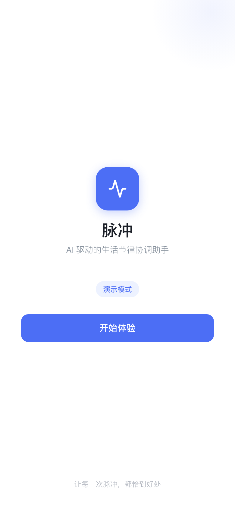
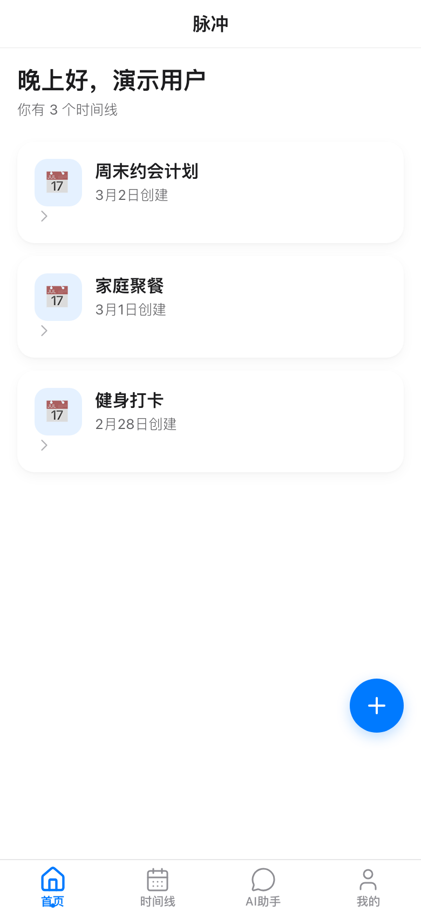
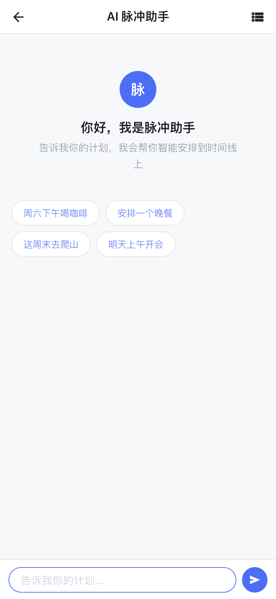
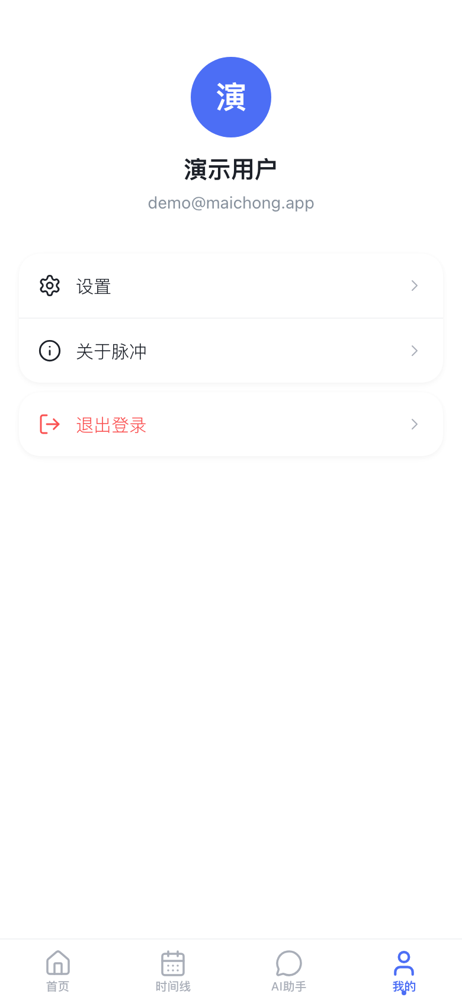
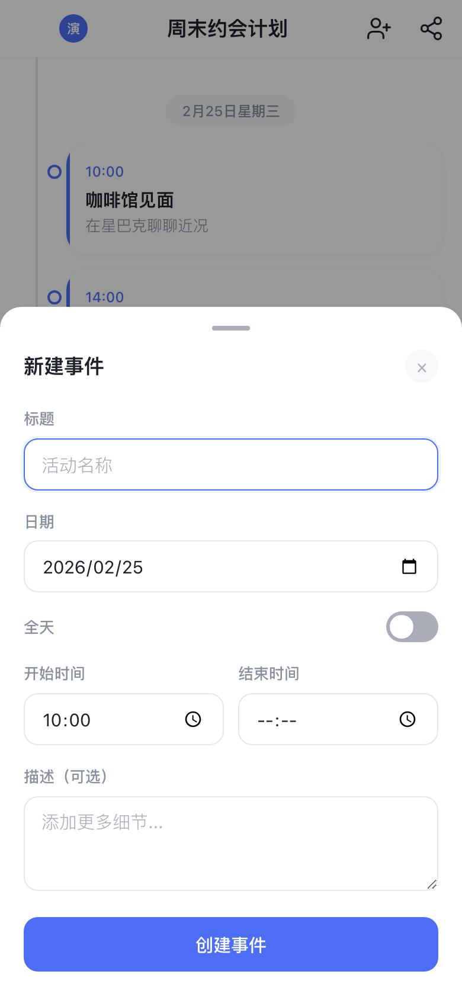

# 脉冲 Maichong

[](https://opensource.org/licenses/MIT)
[](https://maichong.vercel.app)

**AI-native life rhythm coordination assistant for intimate groups.**

一款以 AI 为原生驱动、服务于亲密团体（情侣、家庭、好友）的生活节律协同助手。

**Live Demo**: https://maichong.vercel.app

## Screenshots

<p align="center">
  
  
  
</p>
<p align="center">
  
  
  
</p>

## Features 功能特性

| Feature | Description |
|---------|-------------|
| **Bottom Tab Navigation** | 4-tab layout (Home, Timeline, AI Chat, Profile) inspired by Doubao |
| **Collaborative Timelines** | Create shared timelines with your partner, family, or friends |
| **AI Chat Assistant** | Tell the AI your plans in natural language and it creates events automatically |
| **Realtime Sync** | Changes are synced instantly across all members via Supabase Realtime |
| **Share Cards** | Generate beautiful screenshot cards of your schedule to share |
| **Invite via Link** | Share an invite link to add members to your timeline |
| **Demo Mode** | Try the app without signing up (data stored in localStorage) |

## Tech Stack 技术栈

| Layer | Technology |
|-------|-----------|
| Frontend | Vite + Vanilla JS (ES Modules) |
| Styling | CSS Variables, system fonts |
| Icons | [Lucide](https://lucide.dev) (linear stroke icons, tree-shakeable) |
| Backend | [Supabase](https://supabase.com) (Auth + PostgreSQL + Realtime) |
| AI | GLM-4 (OpenAI-compatible API) |
| Screenshots | modern-screenshot |
| Deployment | Vercel |

## Quick Start 快速开始

```bash
# Install dependencies
npm install

# Start dev server (port 3000)
npm run dev

# Production build
npm run build

# Run E2E tests (requires Chrome)
node scripts/test-e2e.mjs
```

### Configuration 配置

Copy `.env.example` to `.env` and fill in your keys:

```bash
cp .env.example .env
```

```env
VITE_SUPABASE_URL=https://your-project.supabase.co
VITE_SUPABASE_ANON_KEY=your-anon-key
VITE_GLM4_API_KEY=your-glm4-api-key
```

Without `.env`, the app runs in **demo mode** using localStorage.

没有 `.env` 时，应用会以**演示模式**运行，数据存储在 localStorage。

## Architecture 架构

```
src/
├── lib/            # Framework layer (store, router, DOM helpers)
├── services/       # Business logic (auth, timeline, events, AI, realtime)
├── views/          # Page-level views (auth, home, timeline, chat, share, profile)
├── components/     # Reusable UI (header, tab-bar, cards, modals, icons, toast)
├── styles/         # CSS modules (variables, layout, chat, forms, tab-bar...)
├── main.js         # App entry point
├── router.js       # Hash-based SPA router with guards
└── config.js       # Environment config
```

### Key Design Decisions 设计决策

- **No framework** — Vanilla JS with a custom reactive store and hyperscript DOM helpers
- **Three-layer architecture** — `lib/` (zero domain knowledge) → `services/` (business logic) → `views/` + `components/` (presentation)
- **Graceful degradation** — Falls back to localStorage when Supabase is not configured
- **Doubao-inspired UI** — Bottom tab bar, Lucide linear icons, clean white backgrounds

### Routes 路由

| Hash Route | View | Tab |
|---|---|---|
| `#/auth` | Login/signup | hidden |
| `#/` | Home (timeline list) | Home |
| `#/timeline/:id` | Timeline events | Timeline |
| `#/timeline/:id/chat` | AI assistant | AI Chat |
| `#/profile` | User profile | Profile |
| `#/timeline/:id/share` | Share card export | hidden |
| `#/join/:code` | Process invite link | hidden |

## Database 数据库

Schema: `supabase/migrations/001_initial_schema.sql`

Tables: `profiles`, `timelines`, `timeline_members`, `events`, `chat_messages` — all with Row Level Security policies.

## Development 开发

```bash
# Capture screenshots for docs
node scripts/screenshot.mjs

# Run E2E tests (64 tests)
node scripts/test-e2e.mjs
```

## Contributing 贡献

Contributions are welcome! Please feel free to submit a Pull Request.

1. Fork the repository
2. Create your feature branch (`git checkout -b feature/amazing-feature`)
3. Commit your changes (`git commit -m 'feat: add amazing feature'`)
4. Push to the branch (`git push origin feature/amazing-feature`)
5. Open a Pull Request

## License 许可证

[MIT](LICENSE)

## Acknowledgments 致谢

- [Lucide](https://lucide.dev) — Beautiful linear icons
- [Supabase](https://supabase.com) — Open source Firebase alternative
- [Vercel](https://vercel.com) — Deployment platform
