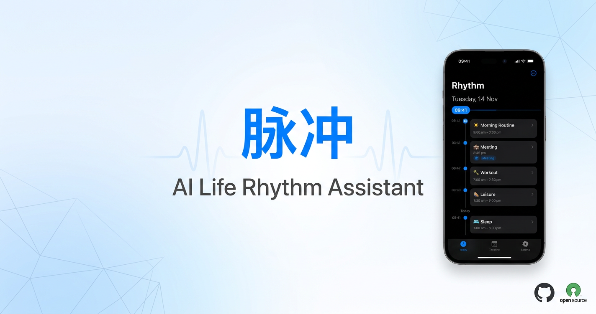
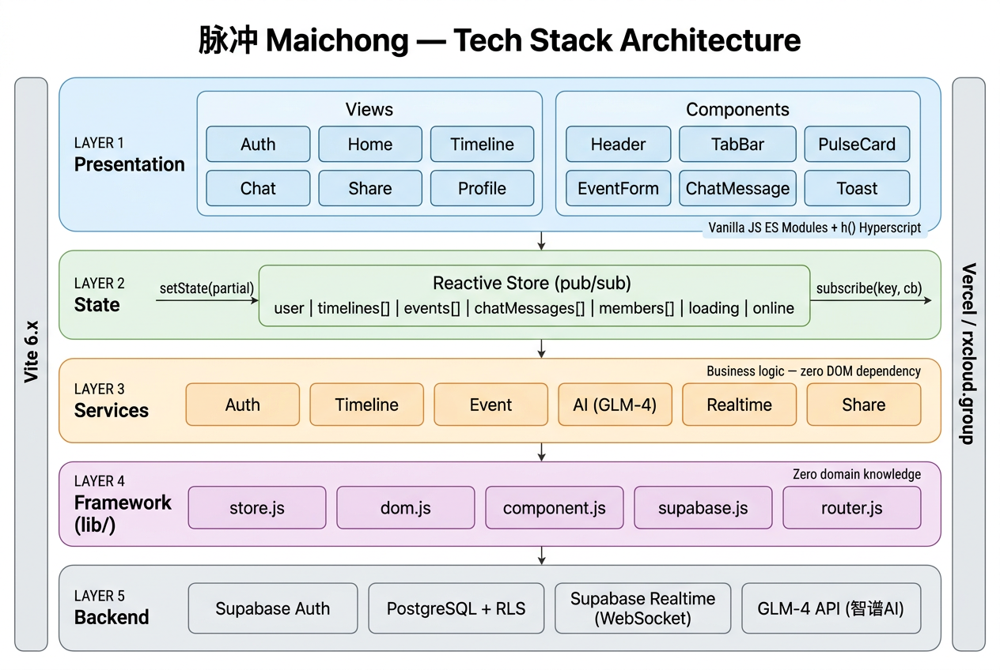
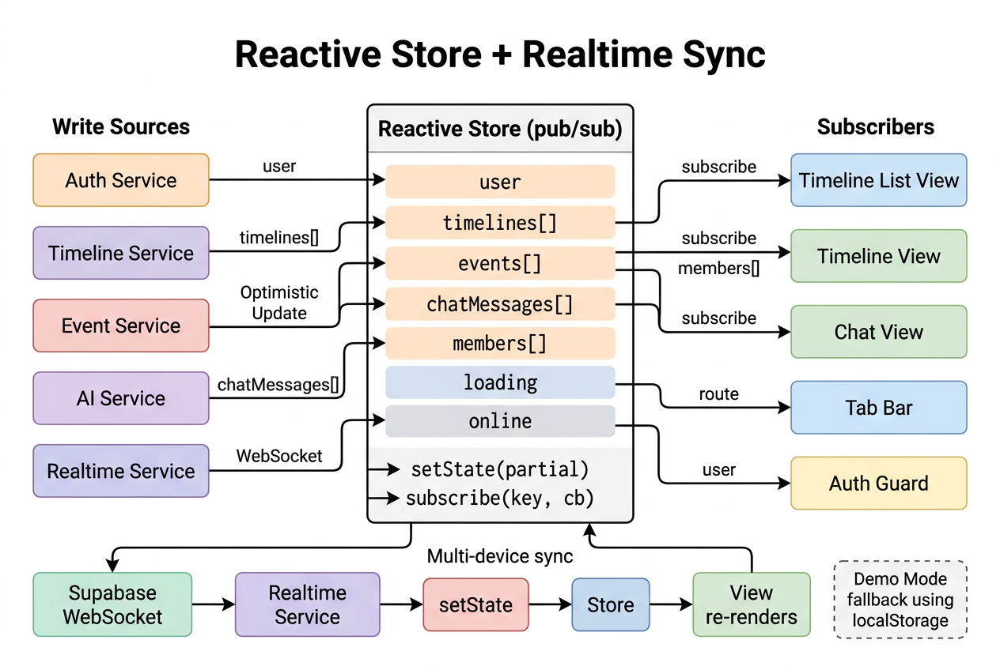
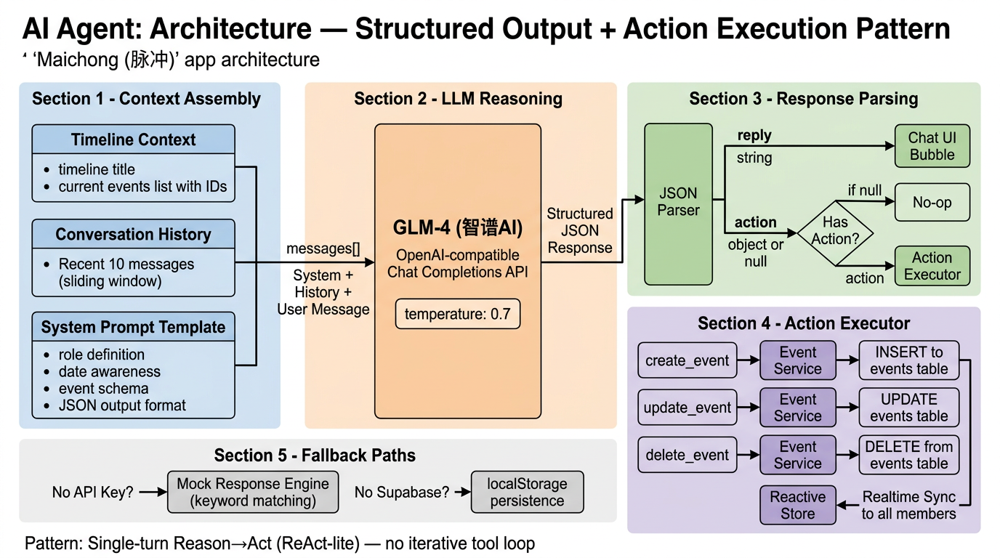
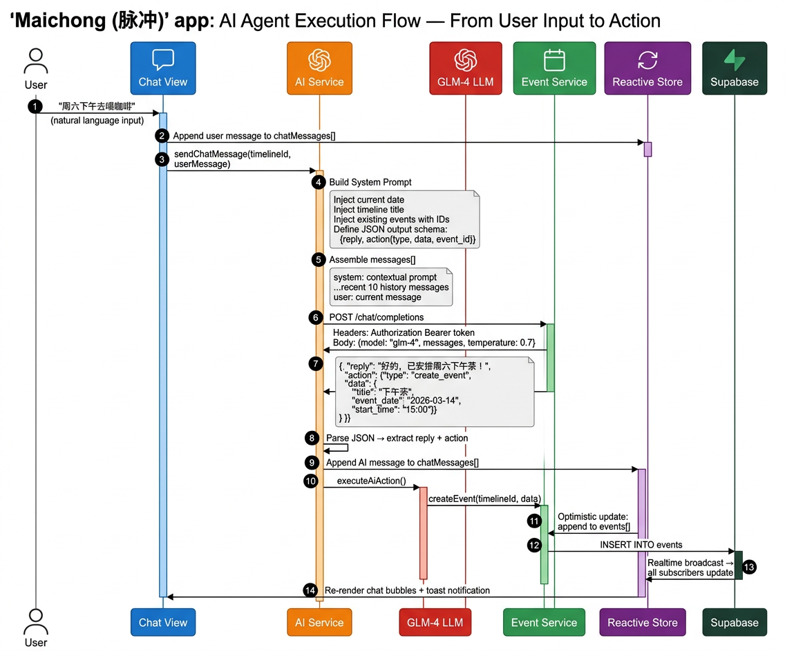

<p align="center">
  
</p>

<h1 align="center">脉冲 Maichong</h1>

<p align="center">
  <a href="https://opensource.org/licenses/MIT"></a>
  <a href="https://maichong.rxcloud.group"></a>
  
  
  
</p>

<p align="center"><strong>AI-native life rhythm coordination assistant for intimate groups.</strong></p>
<p align="center">一款以 AI 为原生驱动、服务于亲密团体（情侣、家庭、好友）的生活节律协同助手。</p>

<p align="center"><strong>Live Demo</strong>: <a href="https://maichong.rxcloud.group">https://maichong.rxcloud.group</a></p>

## Screenshots

<p align="center">
  
  
  
</p>
<p align="center">
  
  
  
</p>

## Features 功能特性

| Feature | Description |
|---------|-------------|
| **Apple/iOS Design** | Authentic iOS design system following Human Interface Guidelines |
| **Collaborative Timelines** | Create shared timelines with your partner, family, or friends |
| **AI Chat Assistant** | Tell the AI your plans in natural language and it creates events automatically |
| **Realtime Sync** | Changes are synced instantly across all members via Supabase Realtime |
| **Share Cards** | Generate beautiful screenshot cards of your schedule to share |
| **Invite via Link** | Share an invite link to add members to your timeline |
| **Demo Mode** | Try the app without signing up (data stored in localStorage) |

## Tech Stack 技术栈

| Layer | Technology |
|-------|-----------|
| Frontend | Vite + Vanilla JS (ES Modules) |
| Styling | CSS Variables, Apple/iOS design system |
| Icons | [Lucide](https://lucide.dev) (linear stroke icons, tree-shakeable) |
| Backend | [Supabase](https://supabase.com) (Auth + PostgreSQL + Realtime) |
| AI | Ark CodingPlan (OpenAI-compatible via Vercel proxy) |
| Screenshots | modern-screenshot |
| Deployment | Vercel |

## Quick Start 快速开始

```bash
# Install dependencies
npm install

# Start dev server (port 3000)
npm run dev

# Production build
npm run build

# Run E2E tests (requires Chrome)
node scripts/test-e2e.mjs
```

### Configuration 配置

Copy `.env.example` to `.env` and fill in your keys:

```bash
cp .env.example .env
```

```env
VITE_SUPABASE_URL=https://your-project.supabase.co
VITE_SUPABASE_ANON_KEY=your-anon-key
VITE_AI_CHAT_ENDPOINT=/api/chat

# Server-side only in Vercel:
# ARK_API_KEY=your_ark_api_key
# ARK_BASE_URL=https://ark.cn-beijing.volces.com/api/coding/v3
# ARK_CHAT_MODEL=doubao-seed-2-0-code-preview-260215
```

Without `.env`, the app runs in **demo mode** using localStorage.

没有 `.env` 时，应用会以**演示模式**运行，数据存储在 localStorage。

## Architecture 架构

### Tech Stack Architecture 技术栈架构

<p align="center">
  
</p>

### System Architecture 系统架构

<p align="center">
  
</p>

### Project Structure 项目结构

<p align="center">
  
</p>

```
src/
├── lib/            # Framework layer (store, router, DOM helpers)
├── services/       # Business logic (auth, timeline, events, AI, realtime)
├── views/          # Page-level views (auth, home, timeline, chat, share, profile)
├── components/     # Reusable UI (header, tab-bar, cards, modals, icons, toast)
├── styles/         # CSS modules (variables, layout, chat, forms, tab-bar...)
├── main.js         # App entry point
├── router.js       # Hash-based SPA router with guards
└── config.js       # Environment config
```

### Key Design Decisions 设计决策

- **No framework** — Vanilla JS with a custom reactive store and hyperscript DOM helpers
- **Three-layer architecture** — `lib/` (zero domain knowledge) → `services/` (business logic) → `views/` + `components/` (presentation)
- **Graceful degradation** — Falls back to localStorage when Supabase is not configured
- **Apple/iOS Design System** — Following Human Interface Guidelines with iOS System Blue (#007AFF), 8pt grid, SF Pro typography scale

### Reactive Store + Realtime Sync 响应式状态与实时同步

<p align="center">
  
</p>

Custom pub/sub reactive store with granular key-level subscriptions. Services write state via `setState(partial)`, views subscribe via `subscribe(key, cb)`. Supabase Realtime pushes `postgres_changes` events over WebSocket for multi-device sync. In demo mode, gracefully degrades to localStorage persistence.

## Design System 设计系统

Built following Apple Human Interface Guidelines:

| Token | Value | Description |
|-------|-------|-------------|
| Primary Color | `#007AFF` | iOS System Blue |
| Success | `#34C759` | iOS Green |
| Warning | `#FF9500` | iOS Orange |
| Danger | `#FF3B30` | iOS Red |
| Tab Bar Height | `49px` | iOS standard |
| Touch Target | `44px` | iOS minimum |
| Spacing | 8pt grid | iOS spacing system |
| Typography | SF Pro scale | Large Title → Caption |

- **Imperceptible shadows** — Apple uses extremely subtle shadows
- **iOS Messages bubbles** — Gray for AI, blue for user
- **No decorative elements** — True minimalism per Apple philosophy

### Routes 路由

| Hash Route | View | Tab |
|---|---|---|
| `#/auth` | Login/signup | hidden |
| `#/` | Home (timeline list) | Home |
| `#/timeline/:id` | Timeline events | Timeline |
| `#/timeline/:id/chat` | AI assistant | AI Chat |
| `#/profile` | User profile | Profile |
| `#/timeline/:id/share` | Share card export | hidden |
| `#/join/:code` | Process invite link | hidden |

## Database 数据库

<p align="center">
  
</p>

Schema: `supabase/migrations/001_initial_schema.sql`

Tables: `profiles`, `timelines`, `timeline_members`, `events`, `chat_messages` — all with Row Level Security policies.

## AI Agent Design AI 智能体设计

### Agent Architecture 智能体架构

The AI assistant follows a **Structured Output + Action Execution** pattern (ReAct-lite: single-turn Reason→Act, no iterative tool loop).

<p align="center">
  
</p>

**How it works:**

1. **Context Assembly** — System prompt is dynamically built with timeline title, current events (with IDs), today's date, and a JSON output schema
2. **LLM Reasoning** — Ark CodingPlan (OpenAI-compatible via Vercel proxy) receives system prompt + recent 10 conversation messages + user input
3. **Structured Output** — LLM returns `{reply: string, action: object|null}` JSON
4. **Action Execution** — If `action` is present, the executor dispatches to Event Service (`create_event` / `update_event` / `delete_event`)
5. **Optimistic Update** — Store updates immediately, Supabase persists, Realtime syncs to all members

### Agent Execution Flow 智能体执行流程

<p align="center">
  
</p>

**Example flow:** User says "周六下午去喝咖啡" → AI Service builds context-aware prompt → Ark CodingPlan reasons about date/time → returns structured JSON with `create_event` action → Event Service creates the event → Store updates → all members see the new event in realtime.

### AI Chat Pipeline AI 聊天流水线

<p align="center">
  
</p>

**Fallback paths:**
- **No API Key** → Mock response engine with keyword matching (demo-friendly)
- **No Supabase** → Chat history persisted to localStorage

## Development 开发

```bash
# Capture screenshots for docs
node scripts/screenshot.mjs

# Run E2E tests (62 tests)
node scripts/test-e2e.mjs
```

## Contributing 贡献

Contributions are welcome! Please feel free to submit a Pull Request.

1. Fork the repository
2. Create your feature branch (`git checkout -b feature/amazing-feature`)
3. Commit your changes (`git commit -m 'feat: add amazing feature'`)
4. Push to the branch (`git push origin feature/amazing-feature`)
5. Open a Pull Request

## License 许可证

[MIT](LICENSE)

## Acknowledgments 致谢

- [Lucide](https://lucide.dev) — Beautiful linear icons
- [Supabase](https://supabase.com) — Open source Firebase alternative
- [Vercel](https://vercel.com) — Deployment platform
