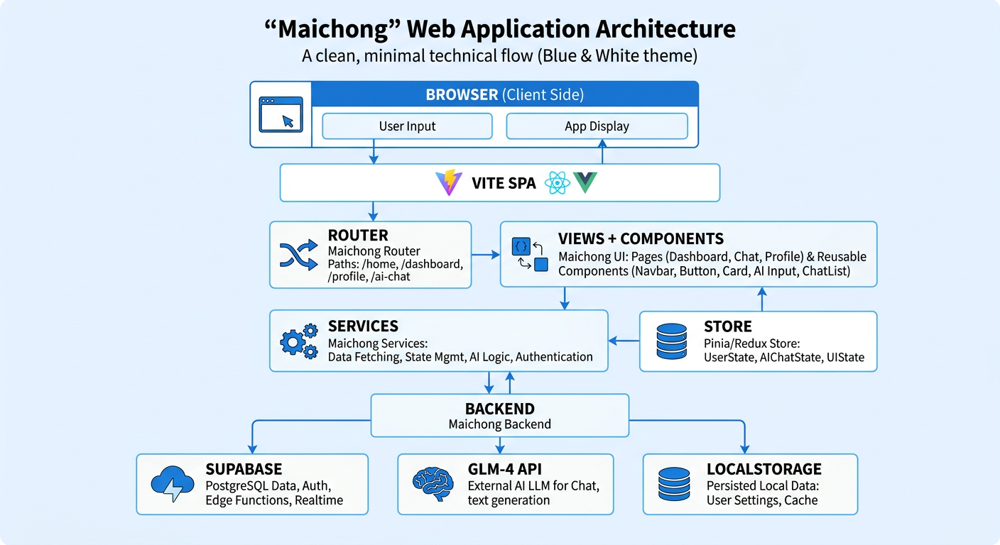
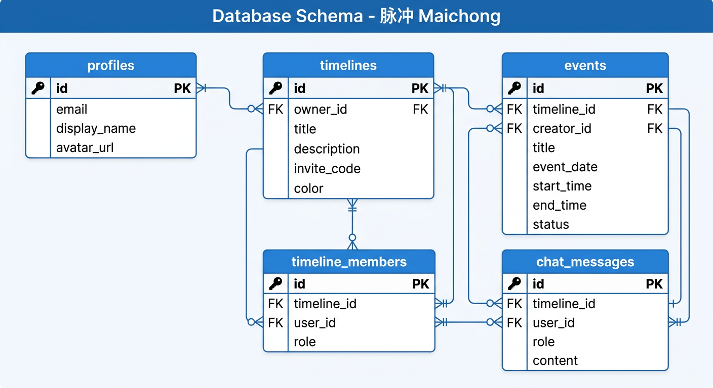
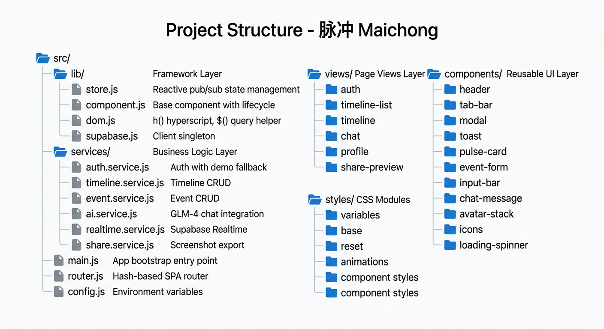
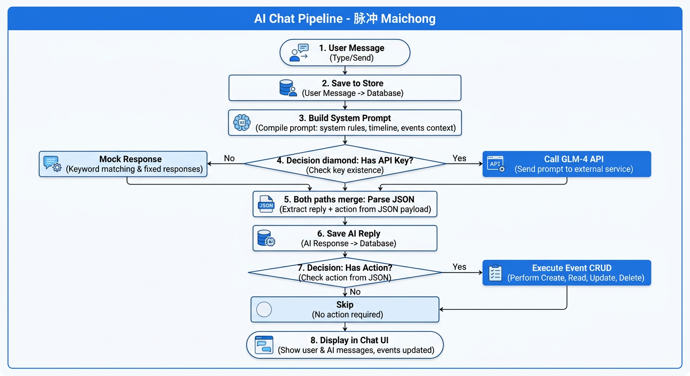
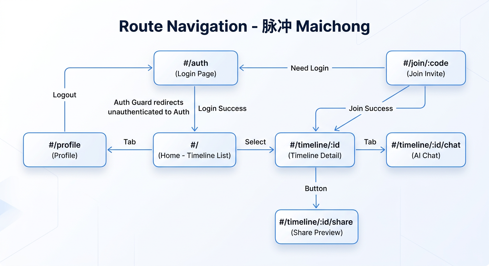

# 脉冲项目 - 技术架构设计

**版本**: 2.0
**日期**: 2026年3月11日
**状态**: 生产阶段

---

## 1. 技术栈总览

### 1.1 前端技术栈

| 层级 | 技术 | 版本 | 用途 |
|------|------|------|------|
| **构建工具** | Vite | 6.x | 开发服务器 + 生产构建 |
| **UI框架** | Vanilla JS | ES2022+ | 无框架，原生 ES Modules |
| **状态管理** | 自研 Store | - | 响应式 Pub/Sub 状态管理 |
| **路由** | 自研 Router | - | 基于 Hash 的 SPA 路由 |
| **DOM 操作** | 自研 Hyperscript | - | `h()` 函数式 DOM 创建 |
| **图标** | Lucide | 0.575+ | 线性描边图标（Tree-shakeable） |
| **截图** | modern-screenshot | 4.4+ | 分享卡片截图生成 |

### 1.2 后端技术栈

| 层级 | 技术 | 版本 | 用途 |
|------|------|------|------|
| **BaaS平台** | Supabase | Latest | 后端即服务 |
| **数据库** | PostgreSQL | 15+ | 主数据存储 |
| **认证** | Supabase Auth | - | 用户认证 |
| **实时订阅** | Supabase Realtime | - | WebSocket 实时同步 |
| **AI 服务** | GLM-4 (智谱AI) | - | OpenAI 兼容 API |

### 1.3 部署与工具

| 工具 | 用途 |
|------|------|
| **Vercel** | 前端部署与 CDN |
| **Node.js 18+** | 开发运行环境 |
| **npm** | 包管理 |
| **Git** | 版本控制 |

---

## 2. 系统架构

### 2.1 整体架构图



```
┌──────────────────────────────────────────────────────────────┐
│                         Browser                                │
├──────────────────────────────────────────────────────────────┤
│  ┌────────────────────────────────────────────────────────┐  │
│  │           Vite + Vanilla JS SPA (ES Modules)           │  │
│  │   main.js → Router (Hash) → Auth Guard → Views        │  │
│  └────────────────────────────────────────────────────────┘  │
├──────────────────────────────────────────────────────────────┤
│  ┌─────────────┐  ┌─────────────┐  ┌─────────────┐          │
│  │  Views (6)  │  │Components   │  │  Styles     │  展示层   │
│  │  Page-level │  │ (12 UI)    │  │ (CSS Vars)  │          │
│  └─────────────┘  └─────────────┘  └─────────────┘          │
├──────────────────────────────────────────────────────────────┤
│  ┌─────────────────────────────────────────────────────┐     │
│  │              Services (业务逻辑层)                    │     │
│  │  auth | timeline | event | ai | realtime | share    │     │
│  └─────────────────────────────────────────────────────┘     │
├──────────────────────────────────────────────────────────────┤
│  ┌─────────────────────────────────────────────────────┐     │
│  │           Reactive Store (Pub/Sub 状态管理)           │     │
│  │       subscribe(key, callback) → 精细化响应           │     │
│  └─────────────────────────────────────────────────────┘     │
├──────────────────────────────────────────────────────────────┤
│  ┌─────────────────────────────────────────────────────┐     │
│  │              lib/ (框架层, 零领域知识)                  │     │
│  │    store.js | component.js | dom.js | supabase.js   │     │
│  └─────────────────────────────────────────────────────┘     │
└──────────────────────────────────────────────────────────────┘
                            │
              ┌─────────────┼─────────────┐
              ▼             ▼             ▼
┌──────────────┐  ┌──────────────┐  ┌──────────────┐
│   Supabase   │  │  GLM-4 API   │  │ localStorage │
│ Auth+DB+RT   │  │  (智谱AI)    │  │ (演示模式)    │
└──────────────┘  └──────────────┘  └──────────────┘
```

### 2.2 数据流架构

```
用户操作 (点击/输入)
   │
   ▼
┌─────────┐
│ Views   │ 触发业务调用
└─────────┘
   │
   ▼
┌─────────────────┐
│    Services     │ 处理业务逻辑
└─────────────────┘
   │
   ├──────────────────┬──────────────────┐
   ▼                  ▼                  ▼
┌──────────┐   ┌──────────────┐   ┌──────────┐
│Supabase  │   │ localStorage │   │ GLM-4    │
│(DB+Auth) │   │ (Demo Mode)  │   │ API      │
└──────────┘   └──────────────┘   └──────────┘
   │                  │                  │
   └──────────────────┴──────────────────┘
                      │
                      ▼
              ┌───────────────┐
              │ Store setState│ 更新状态
              └───────────────┘
                      │
                      ▼
              ┌───────────────┐
              │  Subscribers  │ 订阅回调触发 UI 更新
              └───────────────┘
```

---

## 3. 数据库设计

### 3.1 ER 关系图



### 3.2 核心数据表

#### profiles (用户档案表)
```sql
CREATE TABLE profiles (
  id UUID PRIMARY KEY REFERENCES auth.users(id),
  display_name TEXT,
  avatar_url TEXT,
  created_at TIMESTAMPTZ DEFAULT NOW(),
  updated_at TIMESTAMPTZ DEFAULT NOW()
);
```

#### timelines (时间线表)
```sql
CREATE TABLE timelines (
  id UUID PRIMARY KEY DEFAULT gen_random_uuid(),
  owner_id UUID REFERENCES profiles(id) ON DELETE CASCADE,
  title TEXT NOT NULL,
  description TEXT,
  invite_code TEXT UNIQUE DEFAULT encode(gen_random_bytes(6), 'hex'),
  color TEXT DEFAULT '#007AFF',
  created_at TIMESTAMPTZ DEFAULT NOW(),
  updated_at TIMESTAMPTZ DEFAULT NOW()
);
```

#### timeline_members (时间线成员表)
```sql
CREATE TABLE timeline_members (
  id UUID PRIMARY KEY DEFAULT gen_random_uuid(),
  timeline_id UUID REFERENCES timelines(id) ON DELETE CASCADE,
  user_id UUID REFERENCES profiles(id) ON DELETE CASCADE,
  role TEXT DEFAULT 'member',  -- 'owner', 'admin', 'member'
  joined_at TIMESTAMPTZ DEFAULT NOW(),
  UNIQUE(timeline_id, user_id)
);
```

#### events (脉冲事件表)
```sql
CREATE TABLE events (
  id UUID PRIMARY KEY DEFAULT gen_random_uuid(),
  timeline_id UUID REFERENCES timelines(id) ON DELETE CASCADE,
  creator_id UUID REFERENCES profiles(id),
  title TEXT NOT NULL,
  description TEXT,
  event_date DATE NOT NULL,
  start_time TIME,
  end_time TIME,
  is_all_day BOOLEAN DEFAULT FALSE,
  status TEXT DEFAULT 'confirmed',  -- confirmed, tentative, proposal, cancelled
  created_at TIMESTAMPTZ DEFAULT NOW(),
  updated_at TIMESTAMPTZ DEFAULT NOW()
);
```

#### chat_messages (聊天消息表)
```sql
CREATE TABLE chat_messages (
  id UUID PRIMARY KEY DEFAULT gen_random_uuid(),
  timeline_id UUID REFERENCES timelines(id) ON DELETE CASCADE,
  user_id UUID REFERENCES profiles(id),
  role TEXT NOT NULL,      -- 'user' 或 'assistant'
  content TEXT NOT NULL,
  metadata JSONB DEFAULT '{}',
  created_at TIMESTAMPTZ DEFAULT NOW()
);
```

### 3.3 Row Level Security (RLS) 策略

所有表均启用 RLS。成员只能访问自己所属时间线的数据，创建者可修改自己的事件。

完整 schema 见 `supabase/migrations/001_initial_schema.sql`。

---

## 4. 项目结构

### 4.1 目录结构图



### 4.2 详细结构

```
src/
├── lib/              # 框架层（零领域知识）
│   ├── store.js      # 响应式 Pub/Sub 状态管理
│   ├── component.js  # 基础组件类（挂载/卸载生命周期）
│   ├── dom.js        # h() 创建 DOM, $() 查询选择器
│   └── supabase.js   # Supabase 客户端单例
│
├── services/         # 业务逻辑层（无 DOM 操作）
│   ├── auth.service.js       # 注册/登录/退出，演示模式回退
│   ├── timeline.service.js   # 时间线 CRUD、成员管理、邀请链接
│   ├── event.service.js      # 脉冲事件 CRUD、日期分组、格式化
│   ├── ai.service.js         # GLM-4 聊天集成、系统提示、操作执行
│   ├── realtime.service.js   # Supabase Realtime 订阅
│   └── share.service.js      # 分享卡片生成、截图导出
│
├── views/            # 页面级视图（由路由挂载）
│   ├── auth.view.js          # 登录/注册/演示模式入口
│   ├── timeline-list.view.js # 首页：时间线列表
│   ├── timeline.view.js      # 单个时间线（脉冲卡片 + FAB）
│   ├── chat.view.js          # AI 聊天（iOS Messages 风格）
│   ├── profile.view.js       # 个人中心（iOS Settings 风格）
│   └── share-preview.view.js # 分享卡片预览与下载
│
├── components/       # 可复用 UI 组件
│   ├── header.js / tab-bar.js / modal.js / toast.js
│   ├── pulse-card.js / event-form.js / input-bar.js
│   ├── chat-message.js / avatar-stack.js / icons.js
│   └── loading-spinner.js
│
├── styles/           # CSS 模块（通过 styles/index.css 导入）
│   ├── variables.css    # 设计 Token：iOS System Blue, 8pt 网格
│   ├── base.css / reset.css / animations.css
│   └── 组件级 CSS 文件
│
├── main.js           # 应用引导、路由注册、Supabase Auth 初始化
├── router.js         # Hash-based SPA 路由（带 Guard）
└── config.js         # 环境变量访问
```

---

## 5. 状态管理架构

### 5.1 Reactive Store

自研响应式状态管理，基于 Pub/Sub 模式：

```javascript
// lib/store.js 核心 API
const store = {
  getState()           // 获取当前状态快照
  setState(partial)    // 合并更新状态并通知订阅者
  subscribe(key, cb)   // 监听特定 key 的变化，返回取消函数
}
```

**关键状态 Key**:
- `user` — 当前登录用户
- `timelines` — 时间线列表
- `currentTimeline` — 当前查看的时间线
- `events` — 当前时间线的事件列表
- `members` — 当前时间线的成员列表
- `chatMessages` — 聊天消息列表

### 5.2 数据流模式

```
View 调用 Service
    → Service 执行业务逻辑 (API/localStorage)
    → Service 调用 store.setState()
    → Store 通知所有订阅该 key 的回调
    → View 中的 subscribe 回调更新 DOM
```

---

## 6. AI 集成架构

### 6.1 AI 聊天流程图



### 6.2 系统提示构建

AI 服务会动态构建系统提示，包含：
- 当前时间线信息
- 已有事件列表（含 ID，用于修改/删除）
- 今日日期（用于相对日期推算）
- 响应格式规范（JSON：reply + action）

### 6.3 操作执行

AI 返回的 action 类型：
| type | 说明 | 数据 |
|------|------|------|
| `create_event` | 创建事件 | title, event_date, start_time, end_time, is_all_day |
| `update_event` | 修改事件 | event_id + 修改字段 |
| `delete_event` | 删除事件 | event_id |

### 6.4 降级策略

- **有 API Key** → 调用 GLM-4 API
- **无 API Key** → 关键词匹配模拟响应（咖啡→下午茶、晚餐→晚餐事件、旅行→出游计划）

---

## 7. 路由导航

### 7.1 路由图



### 7.2 路由表

| Hash 路由 | 视图 | Tab 栏 |
|---|---|---|
| `#/auth` | 登录/注册 | 隐藏 |
| `#/` | 首页（时间线列表） | Home |
| `#/timeline/:id` | 时间线详情 | Timeline |
| `#/timeline/:id/chat` | AI 聊天 | AI Chat |
| `#/profile` | 个人中心 | Profile |
| `#/timeline/:id/share` | 分享预览 | 隐藏 |
| `#/join/:code` | 邀请处理 | 隐藏 |

### 7.3 Auth Guard

路由守卫在每次导航前检查：
- 未登录用户 → 重定向到 `#/auth`
- `#/auth` 路由对已登录用户 → 重定向到 `#/`

---

## 8. 安全策略

### 8.1 认证流程

Supabase Auth 提供 Email/Password 认证：
1. 用户注册 → Supabase 创建账户
2. 登录 → 返回 JWT Session
3. 所有 API 请求携带 Auth Token
4. Session 过期自动刷新

### 8.2 API 密钥管理

通过 `.env` 文件管理（不提交到 Git）：
```env
VITE_SUPABASE_URL=https://your-project.supabase.co
VITE_SUPABASE_ANON_KEY=your-anon-key
VITE_GLM4_API_KEY=your-glm4-api-key
```

### 8.3 RLS 数据隔离

所有数据表启用行级安全策略，确保：
- 用户只能访问自己所属时间线的数据
- 成员可创建事件，但只能修改自己创建的事件
- Owner 拥有时间线的完全控制权

---

## 9. 部署架构

### 9.1 开发环境

```
本地开发
  ├── Vite Dev Server (localhost:3000, HMR)
  ├── Supabase Cloud (远程数据库)
  └── VS Code + Browser DevTools
```

### 9.2 生产环境

```
生产部署
  ├── Vercel (https://maichong.rxcloud.group)
  │   ├── 自动部署 (push to main)
  │   ├── 全球 CDN
  │   └── 静态资源 (dist/)
  ├── Supabase Cloud (ap-northeast-1)
  │   ├── PostgreSQL 数据库
  │   ├── Auth 服务
  │   └── Realtime WebSocket
  └── GLM-4 API (智谱AI)
```

---

## 10. 性能优化

| 策略 | 实现方式 | 效果 |
|------|----------|------|
| **零框架** | Vanilla JS, 无虚拟 DOM 开销 | 极小 bundle (<30KB app code) |
| **Tree-shaking** | Lucide ESM 按需导入 | 只包含使用的图标 |
| **Code Splitting** | Vite 自动分包 | Vendor 与 App 代码分离 |
| **精细订阅** | store.subscribe(key) | 只更新变化的 DOM 部分 |
| **乐观更新** | 先更新 UI 再等 API | 用户感知零延迟 |
| **Demo 回退** | localStorage fallback | 无后端也可完整体验 |

---

## 11. 技术债务与风险

| 风险项 | 影响 | 缓解措施 |
|--------|------|----------|
| Supabase 依赖 | 供应商锁定 | 标准 PostgreSQL，可迁移 |
| LLM API 稳定性 | AI 功能可能不可用 | 降级到模拟响应模式 |
| 实时同步冲突 | 多人同时编辑事件 | 乐观更新 + 最后写入胜出 |
| 无 TypeScript | 大型项目维护性 | JSDoc + 模块化保持可读性 |

---

**当前版本**: 生产运行中 (https://maichong.rxcloud.group)
