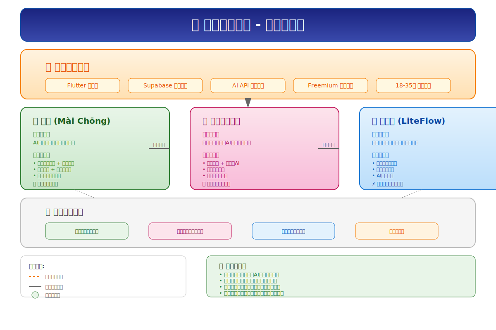
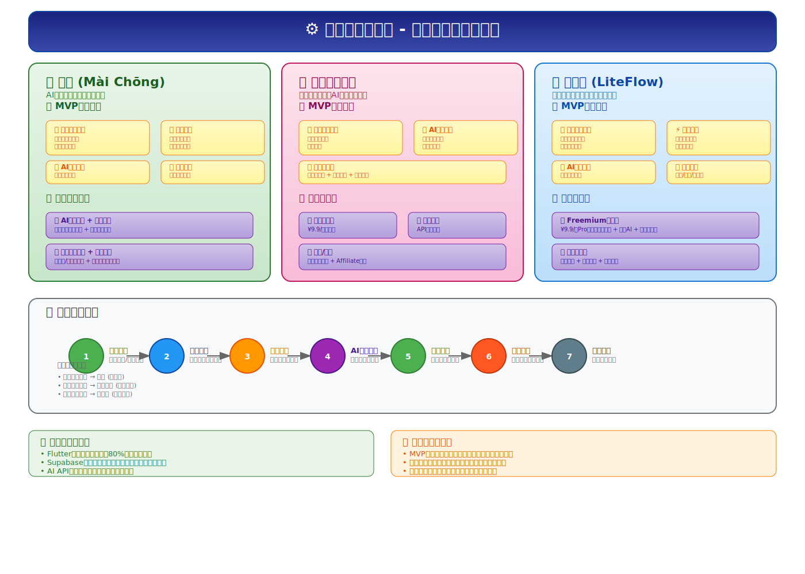
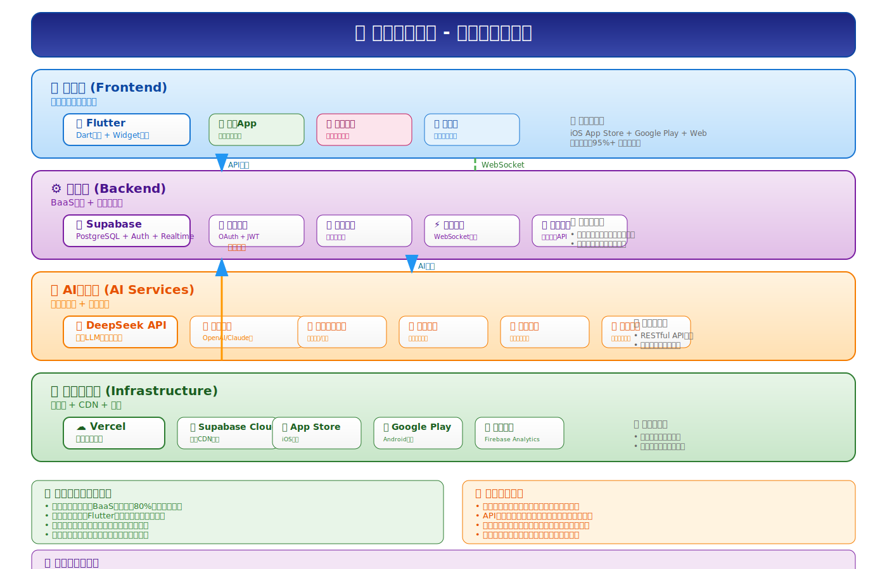

# 项目调研结果与产品示意图

## 📋 项目概述

经过深入分析，脉冲项目是一个专注于**AI驱动的生活节律协同助手**的产品家族，包含三个核心产品：

1. **💓 脉冲 (Mài Chōng)** - 全场景生活节律协同助手
2. **💑 情侣出行助手** - 专为情侣设计的出行规划工具
3. **📅 轻日程 (LiteFlow)** - 极简协作的轻量化日程规划工具

## 🔍 产品分析结果

### 核心定位与差异化

| 产品 | 核心定位 | 差异化优势 | 目标场景 |
|------|----------|------------|----------|
| **脉冲** | AI驱动的生活节律协同助手 | 全功能覆盖，智能排期，多协作模式 | 复杂生活规划、团队协作 |
| **情侣助手** | 专为情侣设计的出行工具 | 情感化AI，浪漫场景推荐 | 情侣出行、浪漫体验 |
| **轻日程** | 极简协作的日程规划工具 | 极致简洁，实时同步 | 简单团队协作、个人规划 |

### 共同技术基础

三个产品共享统一的技术栈，大幅降低开发和维护成本：

- **前端**: Flutter (跨平台开发，95%+代码复用)
- **后端**: Supabase (BaaS服务，实时数据库)
- **AI服务**: DeepSeek API (免费额度，智能分析)
- **商业模式**: Freemium订阅制

## 📊 产品定位架构

### 核心洞察

1. **产品矩阵完整性**: 三个产品形成从垂直深耕到通用覆盖的完整工具矩阵
2. **技术共用优势**: 统一技术栈降低80%重复开发成本
3. **市场验证策略**: 先通过垂直产品快速验证市场，再整合为旗舰产品
4. **用户体验一致性**: 共享UI组件和交互模式，确保品牌一致性

## ⚙️ 产品功能架构

### MVP核心功能对比

| 功能模块 | 脉冲 | 情侣助手 | 轻日程 |
|----------|------|----------|--------|
| 可视化时间线 | ✅ 垂直滚动脉冲卡片 | ✅ 出行时间线 | ✅ 无限滚动时间轴 |
| 实时协作 | ✅ 链接邀请 + 实时同步 | ✅ 双人协作编辑 | ✅ 毫秒级实时同步 |
| AI智能 | ✅ 自然语言录入 | ✅ 情感化浪漫建议 | ✅ 语音文字录入 |
| 特色功能 | 多协作模式、智能排期 | 视觉化预览、氛围展示 | 场景模板、极简设计 |

### 用户流程分析

典型用户旅程：**发现需求 → 选择产品 → 邀请协作 → AI辅助规划 → 实时协作 → 分享成果 → 持续使用**

## 🏗️ 技术架构分析

### 技术选型优势

1. **开发效率**: Flutter + Supabase组合，使开发周期从数月缩短至数周
2. **成本控制**: 充分利用免费额度和服务商补贴，启动成本<500元
3. **扩展性**: 模块化设计支持快速功能迭代和产品扩展
4. **稳定性**: 云原生架构支持高并发和全球化部署

### 关键技术亮点

- **实时协作**: Supabase WebSocket实现毫秒级同步
- **AI集成**: DeepSeek API提供智能分析和内容生成
- **跨平台**: Flutter一套代码支持iOS/Android/Web
- **数据安全**: 端到端加密和隐私保护

## 🎯 产品发展策略

### 阶段性规划

1. **第一阶段 (1-2个月)**: 轻日程和情侣助手MVP上线，验证市场
2. **第二阶段 (3-4个月)**: 数据分析，优化用户体验
3. **第三阶段 (5-8个月)**: 脉冲旗舰版整合上线，实现产品矩阵
4. **第四阶段 (9-12个月)**: 企业服务拓展，商业化变现

### 商业化路径

- **轻日程**: Freemium订阅，¥9.9/月解锁高级功能
- **情侣助手**: 订阅 + 广告/佣金双轨制
- **脉冲**: 企业版服务 + 高级订阅功能

## 💡 核心价值主张

### 用户价值
- **时间效率**: AI智能减少手动输入，提升规划效率
- **协作体验**: 实时同步创造无缝协作体验
- **情感连接**: 专属功能强化亲密关系和团队纽带

### 市场价值
- **技术创新**: AI+协作的独特产品定位
- **成本优势**: 轻创业模式，快速验证市场
- **扩展潜力**: 从垂直场景到通用平台的成长路径

## 🚀 建议与展望

### 优先行动项
1. 立即启动轻日程MVP开发，3周内上线验证
2. 并行开发情侣助手，4周内完成垂直优化
3. 基于用户数据反馈，规划脉冲旗舰版功能

### 风险控制
- 技术风险: 准备AI服务备用方案
- 市场风险: 小范围测试，数据驱动迭代
- 运营风险: 控制节奏，避免单人开发疲劳

### 长期愿景
打造AI驱动的协作生活平台，成为年轻人的"数字生活伙伴"，覆盖从个人规划到团队协作的全场景需求。

---

*调研日期: 2026年1月16日*
*分析工具: SVG架构图设计专家*
*输出格式: 结构化文档 + 可视化图表*